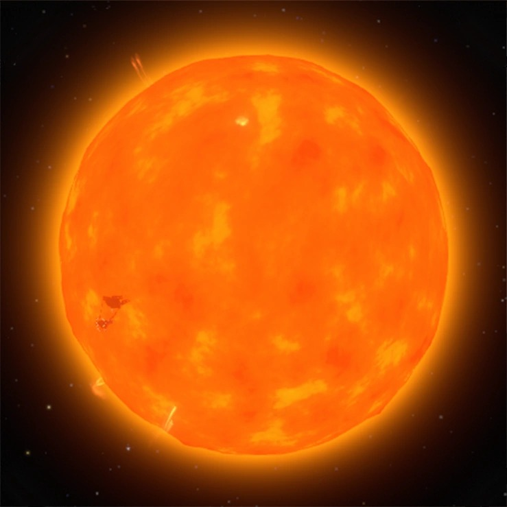
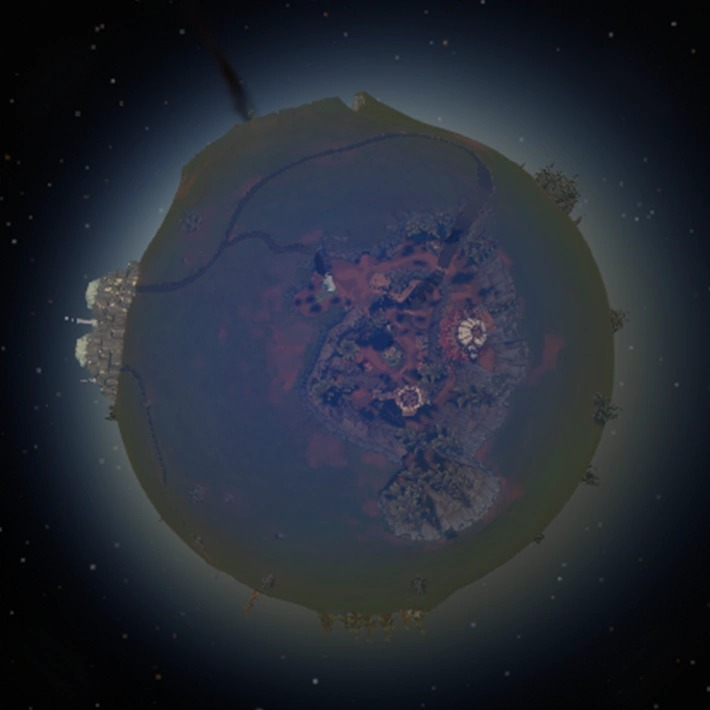
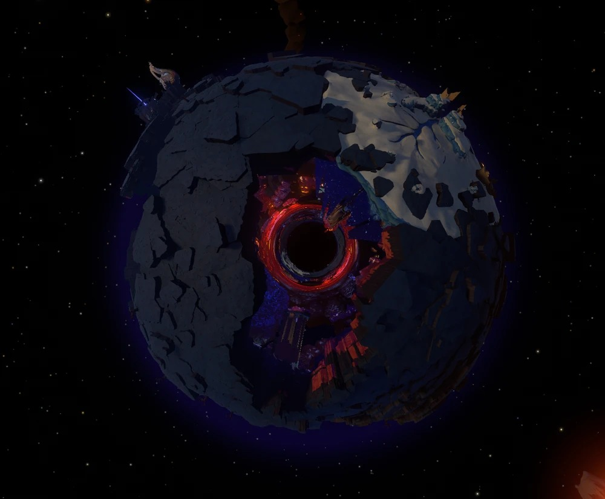
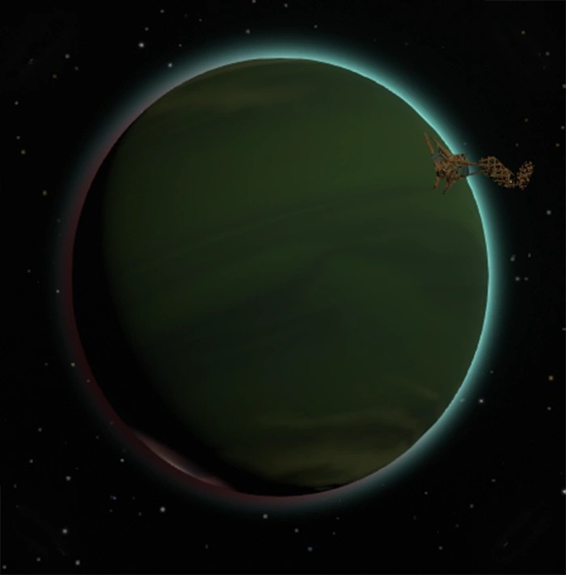
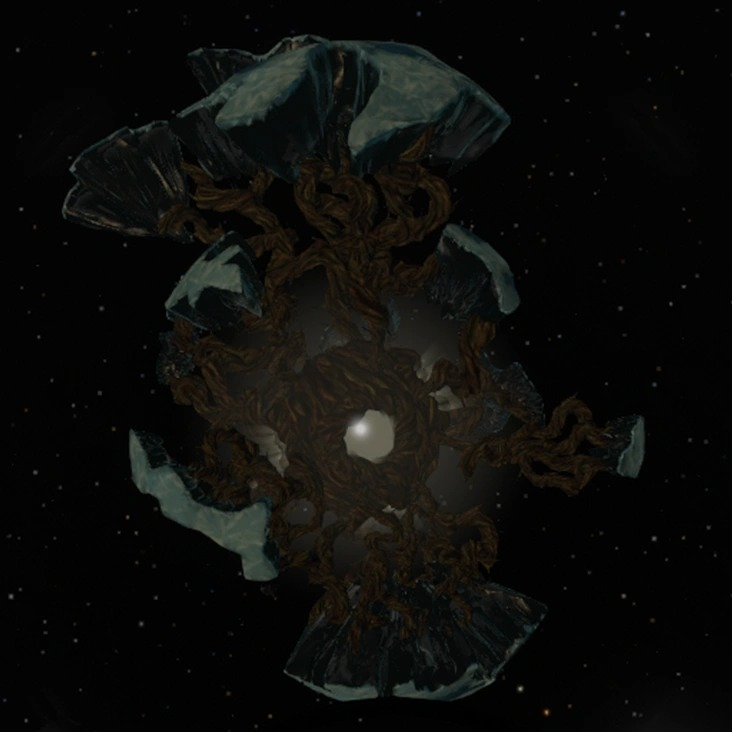
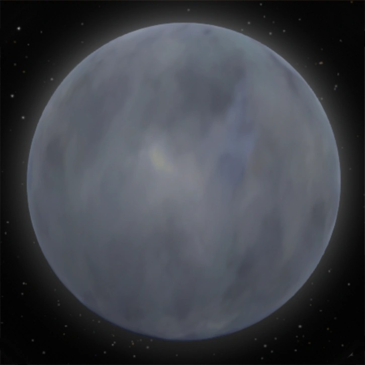
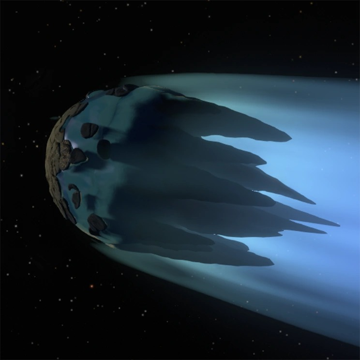

# Simulação do Sistema Solar de Outer Wilds

Este projeto é uma recriação em 3D do sistema solar do jogo Outer Wilds, implementando as mecânicas únicas de cada planeta usando OpenGL e C++. O simulador permite explorar um sistema solar dinâmico onde cada corpo celeste possui comportamentos especiais baseados no jogo original.


## 🎮 Visão Geral do Projeto

Este é um simulador 3D interativo que recria o sistema solar de Outer Wilds, permitindo ao jogador explorar cada planeta e experimentar suas mecânicas únicas. O projeto implementa física realista, sistemas de colisão, mecânicas quânticas e ambientes especiais como o Vazio Infinito.

### Características Principais
- **Exploração 3D em primeira pessoa** com controles de câmera suaves
- **Sistema de física realista** com gravidade e arrasto
- **Mecânicas únicas por planeta** baseadas no jogo original
- **Sistema de iluminação dinâmica** com múltiplas fontes de luz
- **Texturas e modelos 3D** carregados de arquivos OBJ
- **Sistema de menu interativo** para configurações
- **Campo de estrelas** para imersão espacial

## 🪐 Sistema Solar

### Sol

- **Função**: Fonte de luz principal do sistema
- **Mecânica**: Explode no final da animação, marcando o início de um novo ciclo
- **Características**: Textura realista, iluminação dinâmica, animação de explosão

### Recanto Lenhoso (Timber Hearth)


- **Tipo**: Planeta terrestre similar à Terra
- **Mecânica**: Planeta base sem mecânicas especiais
- **Características**: Textura de superfície rochosa, órbita estável

### Vale da Incerteza (Brittle Hollow)


- **Mecânica Principal**: **Fragmentação Dinâmica**
  - O planeta se despedaça ao longo do tempo
  - Peças caem no buraco negro central
  - Fragmentos são teleportados para o buraco branco
- **Implementação**: Sistema de 285 peças individuais com física de queda
- **Controles**: Tecla 'Q' ativa/desativa a fragmentação
- **Visual**: Modelo 3D detalhado com texturas realistas

### Profundezas do Gigante (Giants Deep)


- **Tipo**: Planeta gasoso com oceano interno
- **Mecânica Principal**: **Sistema de Tornados**
  - Múltiplos tornados rotativos na superfície
  - Oceano líquido no interior
  - Atmosfera densa com efeitos visuais
- **Implementação**: Tornados com rotação independente e física de fluido
- **Visual**: Duas esferas concêntricas (atmosfera e oceano)

### Abrolho Sombrio (Dark Bramble)


- **Mecânica Principal**: **Dimensão Infinita**
  - Aparência pequena externamente
  - Interior com espaço infinito
  - Sistema de portais para navegação
- **Implementação**: 
  - Detecção de entrada/saída por bounding boxes
  - Sistema de portais com rotações específicas
  - Transição para o Vazio Infinito
- **Navegação**: Apenas portais corretos levam à saída

### Lua Quântica


- **Mecânica Principal**: **Comportamento Quântico**
  - Teleporta quando sai do campo de visão do jogador
  - Orbita diferentes planetas dinamicamente
  - Efeitos visuais quânticos (brilho, mudança de cor)
- **Implementação**: 
  - Sistema de observação baseado em câmera
  - Cooldown entre saltos quânticos
  - Órbitas dinâmicas ao redor de 4 planetas
- **Visual**: Efeitos de brilho e distorção quântica

### O Xereta (Interloper)


- **Tipo**: Cometa congelado
- **Mecânica**: **Derretimento por Proximidade Solar**
  - Derrete ao se aproximar do Sol
  - Órbita elíptica que varia com o tempo
  - Mudanças visuais baseadas na distância solar
- **Implementação**: Animação orbital com derretimento progressivo

### Buraco Branco
- **Função**: Destino dos fragmentos de Brittle Hollow
- **Mecânica**: Recebe peças teleportadas do buraco negro
- **Visual**: Efeitos de luz e distorção espacial

### Vazio Infinito
- **Mecânica Principal**: **Labirinto Dimensional**
  - Ambiente especial acessível via Dark Bramble
  - Sistema de portais com navegação complexa
  - Efeitos visuais únicos (névoa, iluminação especial)
- **Implementação**: 
  - Sistema de portais com rotações específicas
  - Detecção de navegação correta/incorreta
  - Retorno ao sistema solar principal

## 🎯 Controles e Interação

### Movimento
- **WASD**: Movimento horizontal (frente, trás, esquerda, direita)
- **Espaço**: Movimento para cima
- **B**: Movimento para baixo
- **Mouse**: Controle de câmera (pitch/yaw)

### Controles Especiais
- **L**: Liga/desliga lanterna do jogador
- **1**: Ativa/desativa animação do sistema solar
- **Q**: Ativa/desativa fragmentação do Brittle Hollow
- **M**: Abre/fecha menu de configurações
- **ESC**: Fecha menu ou sai do jogo

### Menu de Configuração
- **+ ou =**: Aumenta velocidade do jogador
- **-**: Diminui velocidade do jogador
- **Velocidade**: Variável de 0.1x a 5.0x
- **Informações**: Exibe controles e configurações atuais

## 🏗️ Arquitetura Técnica

### Estrutura do Projeto
```
Outer-Wilds-Solar-System/
├── src/                    # Código fonte C++
├── include/               # Headers (.h)
├── obj/                   # Objetos compilados (.o)
├── 3d_models/            # Modelos 3D (OBJ, MTL, BLEND)
├── src/image/            # Texturas (JPG, PNG)
├── main                  # Executável principal
├── Makefile              # Sistema de build
└── run.sh               # Script de execução
```

### Componentes Principais

#### Sistema de Renderização
- **OpenGL**: Renderização 3D com iluminação
- **GLUT**: Gerenciamento de janela e entrada
- **SOIL**: Carregamento de texturas
- **FPS**: 60 FPS com delta time

#### Sistema de Física
- **Gravidade**: Atração planetária realista
- **Arrasto**: Resistência do ambiente
- **Colisões**: Sistema de bounding boxes e esferas
- **Teleporte**: Sistema de buracos negros/brancos

#### Sistema de Objetos 3D
- **Carregador OBJ**: Parser para modelos 3D
- **Bounding Sphere**: Detecção de colisão otimizada
- **Texturas**: Mapeamento UV e materiais
- **Iluminação**: Múltiplas fontes de luz

### Classes Principais

#### Player
- **Responsabilidade**: Controle de câmera e movimento
- **Física**: Gravidade, arrasto, velocidade
- **Colisões**: Detecção com todos os objetos
- **Teleporte**: Sistema de buracos negros

#### Planetas (Herança)
- **Base**: Classe genérica para corpos celestes
- **Especializações**: Cada planeta com mecânicas únicas
- **Renderização**: Desenho e animação
- **Física**: Órbitas e rotações

#### QuantumMoon
- **Mecânica Quântica**: Sistema de observação
- **Teleporte**: Saltos entre planetas
- **Visual**: Efeitos especiais

#### Void
- **Dimensão Especial**: Ambiente do Vazio Infinito
- **Portais**: Sistema de navegação
- **Física**: Comportamento único

## 🔧 Compilação e Execução

### Dependências
```bash
# Ubuntu/Debian
sudo apt-get install freeglut3-dev libsoil-dev

# Compilador
g++ com suporte a C++11
```

### Build do Projeto
```bash
# Compilação completa
make clean && make

# Execução
./main

# Ou use o script automatizado
./run.sh
```

### Configurações de Build
- **Otimização**: -O3 para performance
- **Debug**: -g para informações de debug
- **Linking**: OpenGL, GLU, GLUT, SOIL

## 🎨 Recursos Visuais

### Texturas Utilizadas
- **Sol**: `sun.jpg` - Textura solar realista
- **Planetas**: Texturas baseadas em planetas reais
- **Lua**: `moon.jpg` - Superfície lunar
- **Efeitos**: Anéis de Saturno, superfícies planetárias

### Modelos 3D
- **Dark Bramble**: Modelo complexo com múltiplos objetos
- **Brittle Hollow**: 285 peças individuais
- **Void**: Shell, core e portais separados
- **Tornados**: Modelos animados para Giants Deep

### Efeitos Especiais
- **Campo de Estrelas**: 1500 estrelas distribuídas esfericamente
- **Névoa**: Efeito de distância no Void
- **Iluminação**: Múltiplas fontes com sombras
- **Partículas**: Efeitos de fragmentação

## 🚀 Funcionalidades Avançadas

### Sistema de Física
- **Gravidade Realista**: Atração baseada em massa e distância
- **Arrasto Atmosférico**: Resistência em diferentes ambientes
- **Velocidade Variável**: Sistema de aceleração/desaceleração
- **Limites de Velocidade**: Prevenção de movimentos impossíveis

### Sistema de Colisão
- **Bounding Boxes**: Detecção precisa para objetos complexos
- **Bounding Spheres**: Otimização para objetos esféricos
- **Múltiplas Camadas**: Diferentes tipos de colisão por objeto
- **Teleporte**: Sistema de buracos negros/brancos

### Sistema de Animação
- **Delta Time**: Animação independente de FPS
- **Interpolação**: Movimentos suaves entre estados
- **Sincronização**: Coordenação entre sistemas
- **Ciclos**: Loops de animação infinitos

## 🐛 Debug e Desenvolvimento

### Modo Debug
- **Ativação**: `#define DEBUG true` em main.cpp
- **Informações**: Logs de posição e estado
- **Performance**: Monitoramento de FPS
- **Colisões**: Visualização de bounding boxes

### Configurações Avançadas
- **FPS**: Configurável via `#define FPS`
- **Resolução**: `width` e `height` globais
- **Velocidade**: Sistema de multiplicadores
- **Física**: Parâmetros de gravidade e arrasto

## 📝 Notas de Implementação

### Limitações Conhecidas
- **Compilação**: Requer `make clean` antes de `make`
- **Dependências**: GLUT deve estar instalado corretamente
- **Performance**: Modelos complexos podem impactar FPS
- **Plataforma**: Desenvolvido para Linux

### Otimizações Implementadas
- **Culling**: Renderização apenas de objetos visíveis
- **LOD**: Níveis de detalhe baseados em distância
- **Batching**: Agrupamento de objetos similares
- **Cache**: Reutilização de objetos carregados

## 🤝 Contribuição

Este projeto é uma implementação educacional do sistema solar de Outer Wilds. Para contribuições:

1. **Fork** o repositório
2. **Crie** uma branch para sua feature
3. **Implemente** suas mudanças
4. **Teste** extensivamente
5. **Submeta** um pull request

### Áreas de Melhoria
- **Performance**: Otimização de renderização
- **Física**: Sistema de física mais realista
- **UI**: Interface de usuário melhorada
- **Som**: Sistema de áudio espacial
- **Multiplayer**: Suporte a múltiplos jogadores

## 🔬 Especificações Técnicas e Matemáticas

### **Sistema de Física**

#### **Gravidade Newtoniana Implementada**
```cpp
// Força gravitacional: F = G * M * m / r²
float accel = gravity_strength * nearFactor * inv2;
float nearFactor = powf(maxPlanetDist / planet_distances[i], 2.5f);
```

**Parâmetros Físicos:**
- **Constante de Gravidade**: `gravity_strength = 2000.0f`
- **Arrasto Linear**: `linear_drag = 0.10f`
- **Velocidade Máxima**: `max_phys_speed = 300.0f`
- **Esfera de Influência**: `planet_radii[i] * 40.0f`

#### **Cálculos Orbitais**
```cpp
// Posição planetária em coordenadas polares
float px = planet_distances[i] * cosf(planet_rotations[i] * TO_RADIANS);
float pz = -planet_distances[i] * sinf(planet_rotations[i] * TO_RADIANS);
```

**Velocidades Orbitais:**
- **Timber Hearth**: `0.2f * delta_time * 60.0f` rad/s
- **Brittle Hollow**: `0.16f * delta_time * 60.0f` rad/s
- **Giants Deep**: `0.12f * delta_time * 60.0f` rad/s
- **Dark Bramble**: `0.08f * delta_time * 60.0f` rad/s

### **Sistema de Colisão**

#### **Bounding Boxes**
```cpp
struct BoundingBox {
    Vertex min, max;
    bool contains(const Vertex& p) const {
        return (p.x >= min.x && p.x <= max.x &&
                p.y >= min.y && p.y <= max.y &&
                p.z >= min.z && p.z <= max.z);
    }
};
```

#### **Bounding Spheres**
```cpp
struct BoundingSphere {
    Vertex center;
    float radius;
    bool contains(const Vertex& p) const {
        float dist2 = (p.x - center.x)² + (p.y - center.y)² + (p.z - center.z)²;
        return dist2 <= radius²;
    }
};
```

### **Mecânica Quântica da Lua**

#### **Sistema de Observação**
```cpp
// Cálculo de ângulos de visão
float view_angle_x = atan2f(dx, -dz) * 180.0f / PI_F;
float view_angle_y = atan2f(dy, sqrtf(dx*dx + dz*dz)) * 180.0f / PI_F;

// Detecção de observação (cone de 30°)
bool observed = (angle_diff_x < 30.0f && angle_diff_y < 30.0f);
```

**Parâmetros Quânticos:**
- **Cooldown**: `quantum_cooldown = 0.8f` segundos
- **Tempo de Permanência**: `dwell_max_seconds = 20.0f` segundos
- **Distância Máxima**: `2000.0f` unidades
- **Ângulo de Observação**: `30.0f` graus

#### **Teleporte Quântico**
```cpp
// Seleção aleatória de planeta
int new_planet = rand() % num_planets;
current_planet = new_planet;
orbital_angle = 0.0f; // reinicia órbita
```

### **Sistema de Fragmentação (Brittle Hollow)**

#### **Física de Queda**
```cpp
// 285 peças individuais com física independente
std::vector<size_t> available_pieces(285);
std::iota(available_pieces.begin(), available_pieces.end(), 0);
```

**Algoritmo de Fragmentação:**
1. **Seleção Aleatória**: Peça escolhida aleatoriamente
2. **Detecção de Buraco Negro**: Verificação de proximidade
3. **Teleporte**: Movimento para buraco branco
4. **Remoção**: Peça removida da lista ativa

### **Sistema de Coordenadas**

#### **Transformações 3D**
```cpp
// Conversão graus → radianos
#define TO_RADIANS 3.14159/180

// Rotação orbital
float orbital_angle += 18.0f * delta_time;
if (orbital_angle >= 360.0f) orbital_angle -= 360.0f;
```

#### **Câmera First-Person**
```cpp
// Atualização de pitch/yaw
player.update_pitch_yall(dev_x, dev_y);

// Movimento relativo à câmera
void move_forward() {
    camX += sinf(yaw * TO_RADIANS) * speed;
    camZ += cosf(yaw * TO_RADIANS) * speed;
}
```

### **Sistema de Renderização**

#### **Pipeline OpenGL**
```cpp
// Configuração de iluminação
GLfloat global_ambient[] = {0.5f, 0.5f, 0.5f, 0.5f};
glLightModelfv(GL_LIGHT_MODEL_AMBIENT, global_ambient);

// Múltiplas fontes de luz
glEnable(GL_LIGHT0); // Sol
glEnable(GL_LIGHT1); // Buraco branco  
glEnable(GL_LIGHT2); // Jogador
```

#### **Carregamento de Objetos 3D**
```cpp
// Parser OBJ com triangulação automática
void loadObj(const char *fname, GLuint *objects, int qt_objects, 
             int object_indexes[], BoundingBox bboxes[], float scale);

// Limites de geometria
#define MAX_VERTICES 100000
#define MAX_FACES    200000
```

### **Sistema de Animação**

#### **Delta Time**
```cpp
// Animação independente de FPS
float delta_time = (now_ms - last_time_ms) / 1000.0f;
if (delta_time > 0.1f) delta_time = 0.1f; // clamp para estabilidade
```

#### **Interpolação Suave**
```cpp
// Efeitos visuais com interpolação temporal
time_acc += delta_time;
color_shift = time_acc * 0.8f;
glow_intensity = 0.7f + 0.3f * sinf(time_acc * 2.0f);
```

### **Otimizações de Performance**

#### **Culling de Objetos**
```cpp
// Renderização apenas de objetos visíveis
if (!is_visible) return;

// Distância máxima para renderização
if (distance > 2000.0f) return false;
```

#### **Sistema de LOD (Level of Detail)**
```cpp
// Diferentes níveis de detalhe por distância
#define SLICES 30
#define STACKS 20
// Para planetas maiores: SLICES * 3, STACKS * 3
```

### **Algoritmos Especiais**

#### **Campo de Estrelas**
```cpp
// Distribuição esférica uniforme
for (int i = 0; i < NUM_STARS; ++i) {
    float x = (rand() / (float)RAND_MAX) * 2.0f - 1.0f;
    float y = (rand() / (float)RAND_MAX) * 2.0f - 1.0f;
    float z = (rand() / (float)RAND_MAX) * 2.0f - 1.0f;
    float len = sqrtf(x*x + y*y + z*z);
    stars[i][0] = (x / len) * STARFIELD_RADIUS;
}
```

#### **Sistema de Portais (Void)**
```cpp
// Navegação dimensional
enum class Portal {RIGHT, WRONG, NOTHING};
Portal inside(float camX, float camY, float camZ);

// Rotações específicas para portais corretos
int possible_indexes[8] = {0, 1, 3, 4, 5, 6, 8, 9};
```

### **Métricas de Performance**

#### **Configurações de Renderização**
- **FPS Target**: 60 FPS
- **Resolução**: 800x450 (16:9)
- **Campo de Visão**: 60°
- **Distância de Renderização**: 5000 unidades

#### **Limites de Sistema**
- **Estrelas**: 1500 pontos
- **Peças Brittle Hollow**: 285 objetos
- **Objetos Dark Bramble**: 33 elementos
- **Vértices Máximos**: 100,000 por modelo

### **Estruturas de Dados**

#### **Hierarquia de Classes**
```
Player (Física + Câmera)
├── Planet (Base)
│   ├── Sun
│   ├── TimberHearth  
│   ├── BrittleHollow (285 peças)
│   ├── GiantsDeep (Tornados)
│   ├── DarkBramble (Portais)
│   └── Interloper
├── QuantumMoon (Mecânica quântica)
└── Void (Dimensão especial)
```

#### **Sistema de Memória**
```cpp
// Gerenciamento de objetos OpenGL
GLuint objects[MAX_OBJECTS];
glGenLists(1); // Criação de display lists
glNewList(objects[idx], GL_COMPILE); // Compilação
```

### **Equações Matemáticas Implementadas**

#### **Gravidade Newtoniana**
```
F = G * M * m / r²
a = F / m = G * M / r²
```

#### **Movimento Orbital**
```
x = r * cos(θ)
z = r * sin(θ)
θ = θ₀ + ω * t
```

#### **Detecção de Colisão**
```
dist² = (x₁-x₂)² + (y₁-y₂)² + (z₁-z₂)²
colisão = dist² ≤ radius²
```

## 📄 Licença

Este projeto é uma recriação educacional baseada no jogo Outer Wilds da Mobius Digital. Todos os direitos do jogo original pertencem aos seus respectivos proprietários.

---
